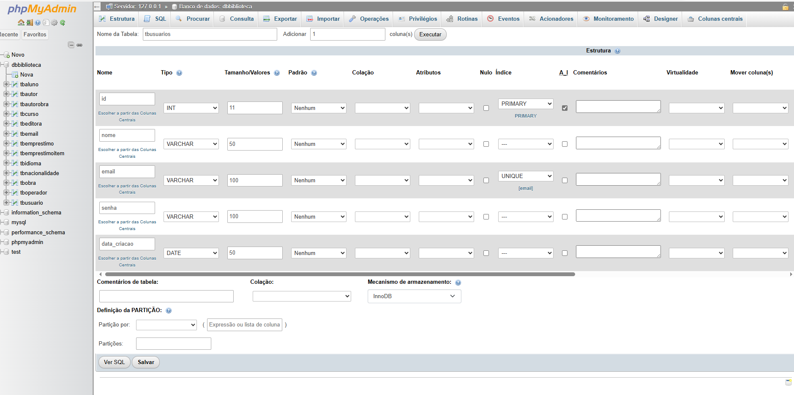
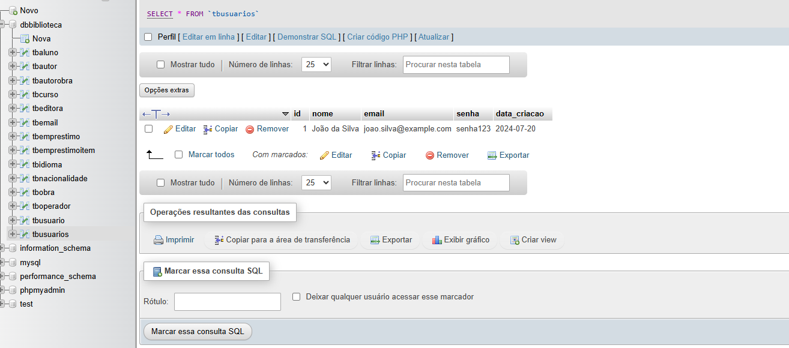

# Atividade avaliativa da discplina de Desenvolvimento Backend, projeto com Crud de usuarios Utilizando o Banco MySQL e Node.js e Postman para explorar os métodos HTTP

## Descrição dos principais comandos para criar projeto no Node.js e prepará-lo para utilizá-lo:
### O Comando: ***"npm init -y"***
#### - comando acima utilizei para inicializar um novo projeto no Node.js, com a flag "-y" que aceita automaticamente todas as configurações padrão.

### O Comando: ***"npm install express --save" e "npm install cors --save"***
#### - ambos os comanos acima, são usados no ambiente de desenvolviemtno de aplicações backend com Node.js para instalar pacotes específicos e salvá-los como dependências no
####     arquivo "package.json".
#### - O comando ***"npm install express --save"***, instala o pacote "express". Onde o mesmo é um framework web para Node.js que facilita a construção de aplicativos web e 
####   APIs. Ele fornece uma série de funcionalidades robustas para desenvolvimento de servidores web e aplicativos. 
#### - O ***"--save"***, esta flag indica que o pacote deve ser adicionado à seção "dependencies" do "package.json". A partir do npm 5, essa flag é desnecessária, pois as dependências 
####   são salvas automaticamente no "package.json".

#### - O comando ***"npm install cors --save"***, instala o pacote "--cors". Que significa com o acrônimo da palavra por: Cross-Origin Resource Sharing, é um mecanismo que
####   permite que recursos restritos em uma página da web sejam solicitados de outro domínio fora do domínio do qual o primeiro recurso foi servido. O pacote "--cors" para Node.js ajuda 
####   a configuarar e gerenciar essas permissões.
#### - "--save", assim como no caso do "express", essa flag adiciona o "cors" às dependências do "package.json". Novamente, com o npm 5 e versões posteriores, esssa flag é desnecessária.

### O comando: ***"npm install express mysql sequelize body-parser jsonwebtoken crypto --save"***
#### O comando utilizado na linha acima, utilizei para instalar múltiplos pacotes e dependências importantes de uma vez neste projeto avaliativo com Node.js.
#### - O pacote "mysql", um pacote que permite a conexão e interação com o banco de dados MYSQL, no caso do projeto aqui utilizei o pacote "mysql2".
#### - O pacote "sequelize", um ORM(Object-Relational Mapping) para Node.js que suporta vários banco de dados MYSQL, incluindo MYSQL.
#### - O pacote "body-parser", um Middleware para Express que analisa o corpo das requisições HTTP, e o torna acessível através de "req.body".
#### - O pacote "jsonwebtoken", um pacote para criar e verificar JSON Web Tokens (JWT), utlizado para autorização e autenticação.
#### - O pacote "crypto", um módulo interno do Node.js para finalidades como operações critográficas.

### Print de imagem abaixo, utilizei para definir os campos necessários e requistados pelo enunciado da atividade lá no banco: "dbbiblioteca" no MySQL, com a tabela definida por: 
### "tbusuarios":
#### 

### Print de imagem abaixo, utilizei para demonstrar resultado da instalação de uma biblioteca chamada por: ***"moment"*** definida no Backend com o Node.js com o propósito de atualizar 
### automaticamente o campo: "data_criacao" na tabela criada "tbusuarios" no MYSQL.  
#### 
#### O arquivo que utilizei a bibliteca ***"moment"***, visualizada na imagem acima está definida no arq. "conexao.js", por uma variável: "const moment = require('moment')", e logo após 
#### por uma função chamada: atualizarDataCriacao() passando variáveis como: "const formattedDate" e "const query" com a consulta no campo especificado no banco MySQL. 
